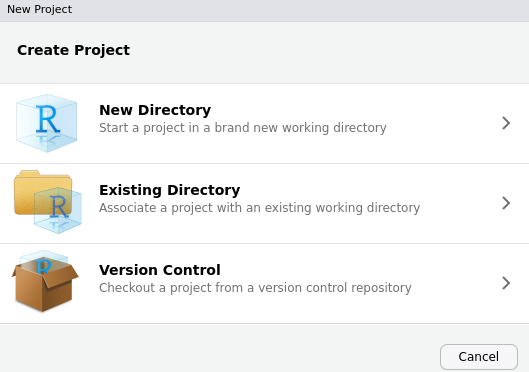
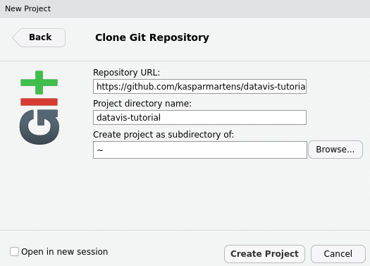

# Visual exploratory (genomic) data analysis in R

Covering

* The importance of visual EDA
* How to use the tidyverse packages (incl ggplot2, tidyr, dplyr) for EDA
* Based on a case study of TCGA breast cancer data. 

### Get started -- download the materials

Open your RStudio and click `File -> New Project`

Select `Version Control`, then `Git` and copy-paste the following link into `Repository URL`:

`https://github.com/kasparmartens/datavis-tutorial.git` 

