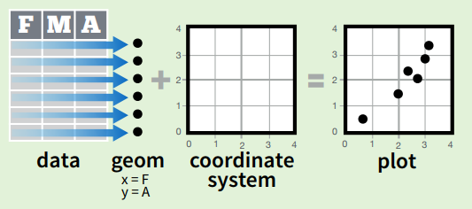
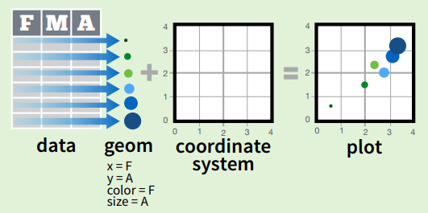

```{r setup, include=FALSE}
options(htmltools.dir.version = FALSE)
```

class: inverse, middle, center

# Why you should first visualise your data before launching an ML algorithm


---
class: middle

Consider the following data (N=20, p=2)

```{r, echo=FALSE, include=FALSE}
library(tidyverse)
set.seed(0)
t <- runif(20, 0, 2*pi)
x <- 2*cos(t)
y <- 2*sin(t)
df <- data.frame(x, y)
```

.pull-left[
```{r, echo=FALSE}
knitr::kable(round(df[1:10, ], 3), format = 'html')
```
]

.pull-right[
```{r, echo=FALSE}
knitr::kable(round(df[11:20, ], 3), format = 'html')
```
]


---
class: middle

.pull-left[
```{r}
mean(x)
mean(y)
cor(x, y)
```
]

--

.pull-right[
Scatterplot immediately reveals the structure

```{r, echo=FALSE, fig.height=4, fig.width=4}
df %>%
  ggplot(aes(x, y)) + 
  geom_point(size=3) + 
  theme_classic()
```
]

---
# Why you should first visualise your data before launching an ML algorithm

Before launching your ML model, you should have a rough idea about:

* Data quality
    * Are there any batch effects?
    * Are there possible sample mislabellings?
    * Outliers? 
    * Distributions - should you apply a transformation?
    
* Expected model fit:
    * Is there strong (linear) signal? 
    * Your expected prediction accuracy (will it be close to random or close to 100%)


---
# Why you should first visualise your data before launching an ML algorithm

```{r, include=FALSE}
n1 <- 50
n2 <- 30
sd <- 0.2
x <- c(rnorm(n1, -1, sd), rnorm(n2, 1, sd), rnorm(n1, -1, sd), rnorm(n2, 1, sd))
y <- c(rnorm(n1, -1, sd), rnorm(n2, 1, sd), rnorm(n1, -1+0.3, sd), rnorm(n2, 1+0.3, sd))
label <- rep(c("A", "A", "B", "B"), c(n1, n2, n1, n2))
batch <- rep(c("1", "2", "1", "2"), c(n1, n2, n1, n2))
df <- data.frame(x, y, label, batch)
```

```{r, echo=FALSE, fig.height=3.5, fig.width=11}
p1 <- df %>%
  ggplot(aes(x, y)) + 
  geom_point() + 
  theme_classic()
p2 <- df %>%
  ggplot(aes(x, y, col=label)) + 
  geom_point() + 
  theme_classic()
p3 <- df %>%
  ggplot(aes(x, y, col=batch)) + 
  geom_point() + 
  theme_classic() + 
  scale_color_brewer(palette="Set1")
```

```{r, echo=FALSE, fig.height=3.5, fig.width=11}
gridExtra::grid.arrange(p1, ncol=3)
```

---
# Why you should first visualise your data before launching an ML algorithm

```{r, echo=FALSE, fig.height=3.5, fig.width=11}
gridExtra::grid.arrange(p1, p2, ncol=3)
```

---
# Why you should first visualise your data before launching an ML algorithm

```{r, echo=FALSE, fig.height=3.5, fig.width=11}
gridExtra::grid.arrange(p1, p2, p3, ncol=3)
```

---
class: top
background-image: url(fig/Anscombes_quartet.png)
background-position: 50% 50%
background-size: 50%

# Are summary statistics sufficient?

.footnote[Source: https://en.wikipedia.org/wiki/Anscombe%27s_quartet]

---
class: top
background-image: url(fig/DinoSequentialSmaller.gif)
background-position: 50% 50%
background-size: 70%

# Are summary statistics sufficient?

.footnote[Source: https://www.autodeskresearch.com/publications/samestats]

---
class: inverse

## Why visualise?

> "The simple graph has brought more information to the data analyst’s mind than any other device." --- John Tukey

## Why R?

Thanks to the tidyverse (https://www.tidyverse.org/) probably the best framework for doing data science.

---
class: top, inverse
background-image: url(https://lsru.github.io/tv_course/img/01_tidyverse_components.png)
background-position: 50% 100%
background-size: 50%

# Tidyverse

A popular collection of R packages for data import, manipulation, exploration and visualization.


* Unified and consistent design and API (unlike base R)
* Intuitive underlying philosophy
* Relatively easy-to-learn

https://www.tidyverse.org/

---
class: inverse, middle

# Outline:

1. Data visualisation using ggplot2

2. Tools for data manipulation and transformation

3. Visual exploratory analysis (combining 1. and 2.)


---
class: top, inverse
background-image: url(http://hexb.in/vector/ggplot2.svg)
background-position: 50% 80%
background-size: 40%

# ggplot2

---
class: top
background-image: url(fig/ggplot2-google-image-search.png)
background-position: 50% 80%
background-size: 70%

# ggplot2

* Quickly iterate over a variety of plots (only making minimal changes to the code). 
* Create publication-quality plots with minimal tweaking. 

.footnote[google image search for "ggplot2"]

---
class: top
background-image: url(fig/grammar-of-graphics.png)
background-position: 50% 80%
background-size: 50%

# ggplot2

Based on the Grammar of Graphics (book by Leland Wilkinson, 1999/2005) -- idea that every graph can be built from the same components. Results in a very flexible framework for plotting. 

---
class: top

# ggplot2 






---

### TCGA breast cancer data set

* Phenotypes:
    * age
    * ER status (estrogen-receptor-positive or negative)
    * PAM50 cancer subtype
* Gene expression data:
    * `log(x+1)` transformed expression for all genes
    * PCA has been applied to expression data => PC1 and PC2 provided

Prepared data frame:

```{r, echo=FALSE}
df <- readRDS("data/TCGA_processed.rds")
knitr::kable(head(df[sample(1:nrow(df)), ], 4), format="html")
```

--

.
Question: Do different subtypes have different expression profiles?

---

# ggplot2 call

```{r, fig.height=4.5, fig.width=4.5}
ggplot(df, aes(x = pc1, y = pc2))
```

---

# ggplot2 call: scatterplot

```{r, fig.height=4.5, fig.width=4.5}
ggplot(df, aes(x = pc1, y = pc2)) + 
  geom_point()
```

---

# scatterplot, colour by ER_status


```{r, fig.height=4.5, fig.width=6}
ggplot(df, aes(x = pc1, y = pc2, col = ER_status)) + 
  geom_point()
```

---

# scatterplot, colour by PAM50 subtype


```{r, fig.height=4.5, fig.width=5.5}
ggplot(df, aes(x = pc1, y = pc2, col = PAM50)) + 
  geom_point()
```

---

# facet by subtype

```{r, fig.height=4.5, fig.width=6}
ggplot(df, aes(x = pc1, y = pc2)) + 
  geom_point() +
 {{facet_wrap(~ PAM50)}}
```

---

# Lets explore the age distribution

--

.pull-left[
```{r, fig.height=4.5, fig.width=6, message=FALSE}
ggplot(df, aes(x = age)) + 
  geom_histogram()
```
]

--

.pull-right[
```{r, fig.height=4.5, fig.width=6}
ggplot(df, aes(x = age)) + 
  geom_density()
```
]

---

# Is age correlated with PC1?

--

```{r, fig.height=4.5, fig.width=6}
ggplot(df, aes(x = age, y = pc1)) + 
  geom_point()
```

---

# Is age correlated with PC1?

```{r, fig.height=4.5, fig.width=6}
ggplot(df, aes(x = age, y = pc1)) + 
  geom_point() +
 {{geom_smooth(method="lm")}}
```

---

# aes() for different layers

Every layer can have its own aesthetics. 

Here, we have only one layer `geom_point()`, so all of the following are equivalent

```{r, eval=FALSE}
ggplot(df, aes(x = age, y = pc1, col = ER_status)) + 
  geom_point()
```

```{r, eval=FALSE}
ggplot(df, aes(x = age, y = pc1)) + 
  geom_point(aes(col = ER_status))
```

```{r, eval=FALSE}
ggplot(df) + 
  geom_point(aes(x = age, y = pc1, col = ER_status))
```

---

# aes() for different layers

.pull-left[
Here `aes(col = ER_status)` is shared for both layers.
```{r, fig.width=5, fig.height=4}
ggplot(df, aes(x = age, y = pc1, col = ER_status)) + 
  geom_point() + 
  geom_smooth(method="lm")
```
]

.pull-right[
Here `aes(col = ER_status)` is specified for `geom_point()` only.
```{r, fig.width=5, fig.height=4}
ggplot(df, aes(x = age, y = pc1)) + 
  geom_point(aes(col = ER_status)) + 
  geom_smooth(method="lm")
```
]

---

# aes(): specifying colour manually

.pull-left[
```{r, fig.width=4, fig.height=4}
ggplot(df, aes(x = age, y = pc1)) + 
  geom_point(col = "green")
```
]

.pull-right[
```{r, fig.width=4, fig.height=4}
ggplot(df, aes(x = age, y = pc1)) + 
  geom_point(aes(col = "green"))
```
]

---

Lets come back to 

```{r, echo=FALSE, fig.height=4.5, fig.width=11}
p1 <- ggplot(df, aes(x = pc1, y = pc2, col = ER_status)) + 
  geom_point()
p2 <- ggplot(df, aes(x = pc1, y = pc2, col = PAM50)) + 
  geom_point()
gridExtra::grid.arrange(p1, p2, nrow=1)
```

PC1 seems to distinguish well between 

1. ER-positive and ER-negative cancers
2. between PAM50 subtypes

What is a good way to visualise this? 

---

For example, you could consider

```{r, fig.height=6, fig.width=8, echo=FALSE, eval=FALSE}
p1 <- ggplot(df, aes(x = ER_status, y = pc1)) + 
  geom_jitter() + 
  ggtitle("geom_jitter()")
p2 <- ggplot(df, aes(x = pc1, col = ER_status)) + 
  geom_density() + 
  ggtitle("geom_density()")
p3 <- ggplot(df, aes(x = ER_status, y = pc1)) + 
  geom_boxplot() + 
  ggtitle("geom_boxplot()")
p4 <- ggplot(df, aes(x = ER_status, y = pc1)) + 
  geom_violin() + 
  ggtitle("geom_violin()")
gridExtra::grid.arrange(p1, p2, p3, p4, nrow=2)
```


.pull-left[
```{r, fig.height=4, fig.width=4, echo=FALSE}
ggplot(df, aes(x = ER_status, y = pc1)) + 
  geom_jitter() + 
  ggtitle("geom_jitter()")
```
```{r, fig.height=4, fig.width=5, echo=FALSE}
ggplot(df, aes(x = pc1, col = ER_status)) + 
  geom_density() + 
  ggtitle("geom_density()")
```
]

.pull-right[
```{r, fig.height=4, fig.width=4, echo=FALSE}
ggplot(df, aes(x = ER_status, y = pc1)) + 
  geom_boxplot() + 
  ggtitle("geom_boxplot()")
```
```{r, fig.height=4, fig.width=4, echo=FALSE}
ggplot(df, aes(x = ER_status, y = pc1)) + 
  geom_violin() + 
  ggtitle("geom_violin()")
```
]

---

# Tweaking

* Combining layers
* Add transparency using `alpha = 0.5`
* Changing the default theme:
    * `+ theme_bw()`
    * `+ theme_classic()`
    * `+ theme_minimal()`
    

.pull-left[
```{r, fig.height=4, fig.width=5, echo=FALSE}
ggplot(df, aes(x = ER_status, y = pc1)) + 
  geom_boxplot(aes(fill = ER_status)) +
  geom_jitter(alpha = 0.1) + 
  theme_classic()
```
]

.pull-right[
```{r, fig.height=4, fig.width=5, echo=FALSE}
ggplot(df, aes(x = pc1, fill = ER_status)) + 
  geom_density(alpha = 0.5) + 
  theme_classic()
```
]

---

# Tweaking further

Adding points to the background

.pull-left[
```{r, fig.height=4.5, fig.width=6, echo=FALSE}
ggplot(df, aes(x = pc1, y = pc2, col=PAM50)) + 
  geom_point() +
  facet_wrap(~ PAM50) + 
  theme_classic() + 
  theme(legend.position="none")
```
]
.pull-right[
```{r, fig.height=4.5, fig.width=6, echo=FALSE}
ggplot(df, aes(x = pc1, y = pc2, col=PAM50)) + 
  geom_point(data = select(df, -PAM50), col="grey70", alpha = 0.5) +
  geom_point() +
  facet_wrap(~ PAM50) + 
  theme_classic() + 
  theme(legend.position="none")
```
]

---

# Your turn

Design an informative (and nice) visualisation for showing how well PC1 distinguishes between PAM50 subtypes. 

---
background-image: url(fig/tidyverse_data_science.png)
background-position: 50% 50%
background-size: 60%

# Data exploration workflow


.footnote[Source: https://lsru.github.io/tv_course]

---

# Dplyr

---

# Pipe

---

# Joining data frames

---

# Your turn

---
class: center, top, inverse
background-image: url(https://raw.githubusercontent.com/LSRU/r_workshop/gh-pages/img/drob_r_pipeline_450.png)
background-position: 50% 80%
background-size: 40%

Tidyverse workflow
