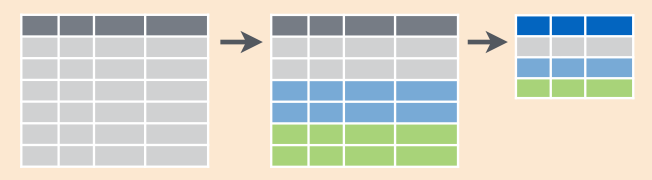
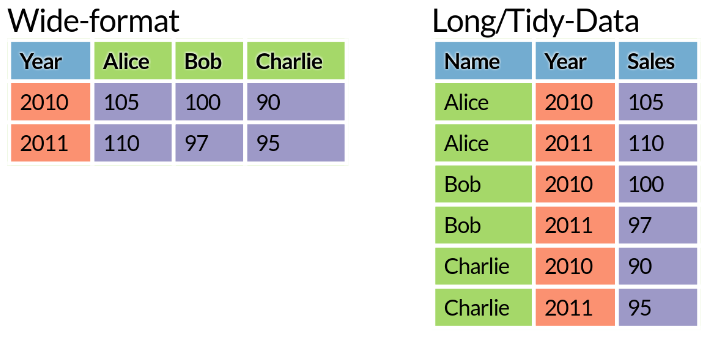
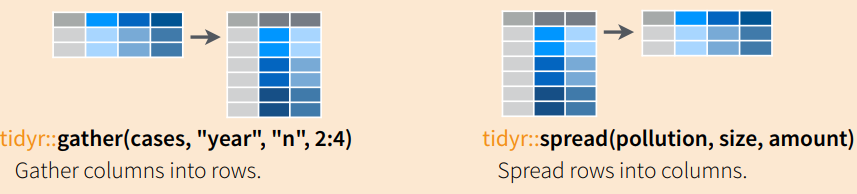

```{r setup, include=FALSE}
options(htmltools.dir.version = FALSE)
```

class: inverse, middle, center

# Why you should first visualise your data before launching an ML algorithm


---
class: middle

Consider the following data (N=20, p=2)

```{r, echo=FALSE, include=FALSE}
library(tidyverse)
set.seed(0)
t <- runif(20, 0, 2*pi)
x <- 2*cos(t)
y <- 2*sin(t)
df <- data.frame(x, y)
```

.pull-left[
```{r, echo=FALSE}
knitr::kable(round(df[1:10, ], 3), format = 'html')
```
]

.pull-right[
```{r, echo=FALSE}
knitr::kable(round(df[11:20, ], 3), format = 'html')
```
]


---
class: middle

.pull-left[
```{r}
mean(x)
mean(y)
cor(x, y)
```
]

--

.pull-right[
Scatterplot immediately reveals the structure

```{r, echo=FALSE, fig.height=4, fig.width=4}
df %>%
  ggplot(aes(x, y)) + 
  geom_point(size=3) + 
  theme_classic()
```
]

---
# Why you should first visualise your data before launching an ML algorithm

Before launching your ML model, you should have a rough idea about:

--

* Data quality
    * Are there any batch effects?
    * Are there possible sample mislabellings?
    * Outliers? 
    * Distributions - should you apply a transformation?

--

* Expected model fit:
    * Is there strong (linear) signal? 
    * Your expected prediction accuracy (will it be close to random or close to 100%)


---
# Why you should first visualise your data before launching an ML algorithm

```{r, include=FALSE}
n1 <- 50
n2 <- 30
sd <- 0.2
x <- c(rnorm(n1, -1, sd), rnorm(n2, 1, sd), rnorm(n1, -1, sd), rnorm(n2, 1, sd))
y <- c(rnorm(n1, -1, sd), rnorm(n2, 1, sd), rnorm(n1, -1+0.3, sd), rnorm(n2, 1+0.3, sd))
label <- rep(c("A", "A", "B", "B"), c(n1, n2, n1, n2))
batch <- rep(c("1", "2", "1", "2"), c(n1, n2, n1, n2))
df <- data.frame(pc1 = x, pc2 = y, label, batch)
```

```{r, echo=FALSE, fig.height=3.5, fig.width=11}
p1 <- df %>%
  ggplot(aes(pc1, pc2)) + 
  geom_point() + 
  theme_classic()
p2 <- df %>%
  ggplot(aes(pc1, pc2, col=label)) + 
  geom_point() + 
  theme_classic()
p3 <- df %>%
  ggplot(aes(pc1, pc2, col=batch)) + 
  geom_point() + 
  theme_classic() + 
  scale_color_brewer(palette="Set1")
```

```{r, echo=FALSE, fig.height=3.5, fig.width=11}
gridExtra::grid.arrange(p1, ncol=3)
```

---
# Why you should first visualise your data before launching an ML algorithm

```{r, echo=FALSE, fig.height=3.5, fig.width=11}
gridExtra::grid.arrange(p1, p2, ncol=3)
```

---
# Why you should first visualise your data before launching an ML algorithm

```{r, echo=FALSE, fig.height=3.5, fig.width=11}
gridExtra::grid.arrange(p1, p2, p3, ncol=3)
```

---
class: inverse, middle

# Are summary statistics good enough?

---
# Are summary statistics good enough?

Do groups A and B have a significantly different measurements x?


```{r, echo=FALSE, fig.height=2, fig.width=10}
n <- 100
x1 <- ifelse(rbinom(n, 1, 0.5) == 0, rnorm(n, 3), rnorm(n, -3))
x2 <- rnorm(n, 3)
cluster <- 
df <- data.frame(x = c(x1, x2), cluster = c(rep("A", n), rep("B", n))) 

p1 <- df %>%
  group_by(cluster) %>%
  summarise(mean = mean(x)) %>%
  ggplot(aes(cluster, mean, col=cluster)) + 
  geom_point(size=4) +
  theme_classic()

p2 <- df %>%
  ggplot(aes(cluster, x, col=cluster)) + 
  geom_boxplot() +
  theme_classic()


p3 <- df %>%
  ggplot(aes(cluster, x, col=cluster)) + 
  geom_boxplot() +
  geom_jitter(alpha = 0.5) +
  theme_classic()
```

```{r, echo=FALSE, fig.height=2, fig.width=10}
gridExtra::grid.arrange(p1, ncol=3)
```

---
# Are summary statistics good enough?

Do groups A and B have a significantly different measurements x?

```{r, echo=FALSE, fig.height=2, fig.width=10}
gridExtra::grid.arrange(p1, p2, ncol=3)
```

---
# Are summary statistics good enough?

Do groups A and B have a significantly different measurements x?

```{r, echo=FALSE, fig.height=2, fig.width=10}
gridExtra::grid.arrange(p1, p2, p3, ncol=3)
```

--

group means `<` boxplot `<` data

---
class: top
background-image: url(fig/Anscombes_quartet.png)
background-position: 50% 60%
background-size: 50%

# Are summary statistics good enough?

Is there a significant association between two continuous variables x and y?

.footnote[Source: https://en.wikipedia.org/wiki/Anscombe%27s_quartet]

---
class: top
background-image: url(fig/DinoSequentialSmaller.gif)
background-position: 50% 50%
background-size: 70%

# Are summary statistics good enough?

.footnote[Source: https://www.autodeskresearch.com/publications/samestats]


---
class: inverse

## Why visualise?

> "The simple graph has brought more information to the data analyst’s mind than any other device." --- John Tukey

## Why R?

Thanks to the tidyverse (https://www.tidyverse.org/) probably the best framework for doing data science.

---
class: top, inverse
background-image: url(https://lsru.github.io/tv_course/img/01_tidyverse_components.png)
background-position: 50% 90%
background-size: 40%

# Tidyverse

A popular collection of R packages for data import, manipulation, exploration and visualization.


* Unified and consistent design and API (unlike base R)
* Intuitive underlying philosophy
* Easy-to-learn
* Easy to get help: large community on stackoverflow, twitter #rstats etc


---
class: inverse, middle

# Outline:

1. Data visualisation using ggplot2

2. Tools for data manipulation and transformation

3. Visual exploratory analysis (combining 1. and 2.)


.footnote[Fig source: http://r4ds.had.co.nz]

---
class: top, inverse
background-image: url(http://hexb.in/vector/ggplot2.svg)
background-position: 50% 80%
background-size: 40%

# ggplot2

---
class: top
background-image: url(fig/ggplot2-google-image-search.png)
background-position: 50% 80%
background-size: 70%

# ggplot2

* Quickly iterate over a variety of plots (only making minimal changes to the code). 
* Create publication-quality plots with minimal tweaking. 

.footnote[google image search for "ggplot2"]

---
class: top
background-image: url(fig/learning_curve.png)
background-position: 50% 80%
background-size: 70%

# ggplot2 learning curve

.footnote[Source: https://github.com/jennybc/ggplot2-tutorial]

---
class: top
background-image: url(fig/grammar-of-graphics.png)
background-position: 50% 80%
background-size: 50%

# ggplot2

Based on the Grammar of Graphics (book by Leland Wilkinson, 1999/2005) -- idea that every graph can be built from the same components. Results in a very flexible framework for plotting. 

---
class: top

# ggplot2 


---

### TCGA breast cancer data set

* Phenotypes:
    * age
    * ER status (estrogen-receptor-positive or negative)
    * PAM50 cancer subtype
* Gene expression data:
    * `log(x+1)` transformed expression for all genes
    * PCA has been applied to expression data => PC1 and PC2 provided

Prepared data frame:

```{r, echo=FALSE}
df <- readRDS("data/TCGA_processed.rds")
knitr::kable(head(df[sample(1:nrow(df)), ], 4), format="html")
```

--

**Question**: Do different subtypes have different expression profiles?

---

# ggplot2 call

```{r, fig.height=4.5, fig.width=4.5}
library(ggplot2)

ggplot(df, aes(x = pc1, y = pc2))
```

---

# ggplot2 call: scatterplot

```{r, fig.height=4.5, fig.width=4.5}
ggplot(df, aes(x = pc1, y = pc2)) + 
  geom_point()
```

---

# scatterplot, colour by ER_status


```{r, fig.height=4.5, fig.width=6}
ggplot(df, aes(x = pc1, y = pc2, col = ER_status)) + 
  geom_point()
```

---

# scatterplot, colour by PAM50 subtype


```{r, fig.height=4.5, fig.width=5.5}
ggplot(df, aes(x = pc1, y = pc2, col = PAM50)) + 
  geom_point()
```

---

# facet by subtype

```{r, fig.height=4.5, fig.width=6}
ggplot(df, aes(x = pc1, y = pc2)) + 
  geom_point() +
 {{facet_wrap(~ PAM50)}}
```

---

# Lets explore the age distribution

--

.pull-left[
```{r, fig.height=4.5, fig.width=6, message=FALSE}
ggplot(df, aes(x = age)) + 
  geom_histogram()
```
]

--

.pull-right[
```{r, fig.height=4.5, fig.width=6}
ggplot(df, aes(x = age)) + 
  geom_density()
```
]

---

# Is age correlated with PC1?

--

```{r, fig.height=4.5, fig.width=6}
ggplot(df, aes(x = age, y = pc1)) + 
  geom_point()
```

---

# Is age correlated with PC1?

```{r, fig.height=4.5, fig.width=6}
ggplot(df, aes(x = age, y = pc1)) + 
  geom_point() +
 {{geom_smooth(method="lm")}}
```

---

# aes() for different layers

Every layer can have its own aesthetics. 

Here, we have only one layer `geom_point()`, so all of the following are equivalent

```{r, eval=FALSE}
ggplot(df, aes(x = age, y = pc1, col = ER_status)) + 
  geom_point()
```

```{r, eval=FALSE}
ggplot(df, aes(x = age, y = pc1)) + 
  geom_point(aes(col = ER_status))
```

```{r, eval=FALSE}
ggplot(df) + 
  geom_point(aes(x = age, y = pc1, col = ER_status))
```

---

# aes() for different layers

.pull-left[
Here `aes(col = ER_status)` is shared for both layers.
```{r, fig.width=5, fig.height=4}
ggplot(df, aes(x = age, y = pc1, col = ER_status)) + 
  geom_point() + 
  geom_smooth(method="lm")
```
]

.pull-right[
Here `aes(col = ER_status)` is specified for `geom_point()` only.
```{r, fig.width=5, fig.height=4}
ggplot(df, aes(x = age, y = pc1)) + 
  geom_point(aes(col = ER_status)) + 
  geom_smooth(method="lm")
```
]

---

# aes(): specifying colour manually

.pull-left[
```{r, fig.width=4, fig.height=4}
ggplot(df, aes(x = age, y = pc1)) + 
  geom_point(col = "green")
```
]

.pull-right[
```{r, fig.width=4, fig.height=4}
ggplot(df, aes(x = age, y = pc1)) + 
  geom_point(aes(col = "green"))
```
]

---

Lets come back to 

```{r, echo=FALSE, fig.height=4.5, fig.width=11}
p1 <- ggplot(df, aes(x = pc1, y = pc2, col = ER_status)) + 
  geom_point()
p2 <- ggplot(df, aes(x = pc1, y = pc2, col = PAM50)) + 
  geom_point()
gridExtra::grid.arrange(p1, p2, nrow=1)
```

PC1 seems to distinguish well between 

1. ER-positive and ER-negative cancers
2. between PAM50 subtypes

What is a good way to visualise this? 

---

For example, you could consider

```{r, fig.height=6, fig.width=8, echo=FALSE, eval=FALSE}
p1 <- ggplot(df, aes(x = ER_status, y = pc1)) + 
  geom_jitter() + 
  ggtitle("geom_jitter()")
p2 <- ggplot(df, aes(x = pc1, col = ER_status)) + 
  geom_density() + 
  ggtitle("geom_density()")
p3 <- ggplot(df, aes(x = ER_status, y = pc1)) + 
  geom_boxplot() + 
  ggtitle("geom_boxplot()")
p4 <- ggplot(df, aes(x = ER_status, y = pc1)) + 
  geom_violin() + 
  ggtitle("geom_violin()")
gridExtra::grid.arrange(p1, p2, p3, p4, nrow=2)
```


.pull-left[
```{r, fig.height=4, fig.width=4, echo=FALSE}
ggplot(df, aes(x = ER_status, y = pc1)) + 
  geom_jitter() + 
  ggtitle("geom_jitter()")
```
```{r, fig.height=4, fig.width=5, echo=FALSE}
ggplot(df, aes(x = pc1, col = ER_status)) + 
  geom_density() + 
  ggtitle("geom_density()")
```
]

.pull-right[
```{r, fig.height=4, fig.width=4, echo=FALSE}
ggplot(df, aes(x = ER_status, y = pc1)) + 
  geom_boxplot() + 
  ggtitle("geom_boxplot()")
```
```{r, fig.height=4, fig.width=4, echo=FALSE}
ggplot(df, aes(x = ER_status, y = pc1)) + 
  geom_violin() + 
  ggtitle("geom_violin()")
```
]

---

# Tweaking

* Combining layers
* Add transparency using `alpha = 0.5`
* Changing the default theme:
    * `+ theme_bw()`
    * `+ theme_classic()`
    * etc, see also the ggthemes package
* Check out the ggplot2 cheat sheet by RStudio


.pull-left[
```{r, fig.height=4, fig.width=5, echo=FALSE}
ggplot(df, aes(x = ER_status, y = pc1)) + 
  geom_boxplot(aes(fill = ER_status), outlier.shape = NA) +
  geom_jitter(alpha = 0.1) + 
  theme_classic()
```
]

.pull-right[
```{r, fig.height=4, fig.width=5, echo=FALSE}
ggplot(df, aes(x = pc1, fill = ER_status)) + 
  geom_density(alpha = 0.5) + 
  theme_classic()
```
]

---

# Further tweaking

Adding points to the background

.pull-left[
```{r, fig.height=4.5, fig.width=6, echo=FALSE}
ggplot(df, aes(x = pc1, y = pc2, col=PAM50)) + 
  geom_point() +
  facet_wrap(~ PAM50) + 
  theme_classic() + 
  theme(legend.position="none")
```
]
.pull-right[
```{r, fig.height=4.5, fig.width=6, echo=FALSE}
ggplot(df, aes(x = pc1, y = pc2, col=PAM50)) + 
  geom_point(data = select(df, -PAM50), col="grey70", alpha = 0.5) +
  geom_point() +
  facet_wrap(~ PAM50) + 
  theme_classic() + 
  theme(legend.position="none")
```
]

---

# Your turn

```{r, echo=FALSE, fig.height=4.5, fig.width=5.5}
ggplot(df, aes(x = pc1, y = pc2, col = PAM50)) + 
  geom_point()
```

Design an informative (and nice) visualisation for showing how well PC1 distinguishes between PAM50 subtypes. 

---

Note: So far we have been using a nice clean prepared data set. But in reality, they came from two different data sources:

* clinical variables / phenotypes
* gene expression data

=> Data cleaning and transformations need to be carried out. 

---
background-image: url(fig/tidyverse_data_science.png)
background-position: 50% 50%
background-size: 60%

# Data exploration workflow


.footnote[Source: https://lsru.github.io/tv_course]

---
# 

---

class: inverse, middle

# Data transformation using dplyr

---

# Subset rows with filter()


Example: 

```{r, eval=FALSE}
filter(df, ER_status == "Positive")
```

```{r, eval=FALSE}
filter(df, ER_status == "Positive", PAM50 %in% c("LumA", "LumB"))
```

---

# Subset columns with select()


Example: 

```{r, eval=FALSE}
select(df, id, pc1, pc2)
```

Or exclude certain columns

```{r, eval=FALSE}
select(df, -ER_status, -PAM50)
```

---
# Add a new column with mutate()


Example: 

```{r, eval=FALSE}
mutate(df, scaled_pc1 = 100 * pc1)
```

---

### group_by() and summarise()



Example: 

```{r}
grouped_df <- group_by(df, ER_status)
summarise(grouped_df, count = n(), mean_pc1 = mean(pc1))
```

---

# Pipes `%>%`

Introducing `%>%`, to help you write code in a way that easier to read and understand.

`g(f(x))` can be rewritten using the pipe `x %>% f() %>% g()`


--

E.g. the following

```{r, eval=FALSE}
df_filtered <- filter(df, ER_status == "Positive")
grouped_df <- group_by(df, PAM50)
summarise(grouped_df, count = n(), mean_pc1 = mean(pc1))
```

can be rewritten 

```{r, eval=FALSE}
df %>%
  filter(ER_status == "Positive") %>%
  group_by(PAM50) %>%
  summarise(count = n(), mean_pc1 = mean(pc1))
```

--

* No need for storing intermediate variables.
* Easier to read and write.

---

# Dplyr in one slide

* Pick observations by their values (`filter()`).
* Reorder the rows (`arrange()`).
* Pick variables by their names (`select()`).
* Create new variables with functions of existing variables (`mutate()`).
* Collapse many values down to a single summary (`summarise()`).


All of these functions follow a common design:

* The first argument is a data frame.
* The subsequent arguments describe what to do with the data frame, using the variable names (without quotes).
* The result is a new data frame.

---

# Your turn

1. Order the PAM50 subtypes by the number of observations in each subtype. 
2. Calculate the mean PC1 and PC2 value for every PAM50 subtype. Can you add this to the PC1-PC2 scatterplot?

---

# Tidy data

> “Tidy datasets are all alike, but every messy dataset is messy in its own way.” –– Hadley Wickham

1. Each variable must have its own column. 
2. Each observation must have its own row. 
3. Each value must have its own cell.


---

# Tidy vs untidy data



--

What is tidy format for a gene expression matrix?

We should ask ourselves: Is our data trapped in column names? Column headers should be variable names (but not values). -- When we want to perform an operation/calculation *for every gene*, this is the case. 

.footnote[Fig source: http://eriqande.github.io/rep-res-web/lectures/]

---

# tidyr for converting between the two formats


--



---

# Joining data frames


---
class: center, top, inverse
background-image: url(https://raw.githubusercontent.com/LSRU/r_workshop/gh-pages/img/drob_r_pipeline_450.png)
background-position: 50% 80%
background-size: 40%

Tidyverse workflow
