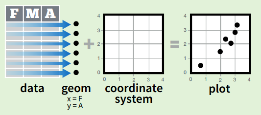

class: top, inverse
background-image: url(https://lsru.github.io/tv_course/img/01_tidyverse_components.png)
background-position: 50% 90%
background-size: 40%

# Tidyverse

A popular collection of R packages for data import, manipulation, exploration and visualization.


* Unified and consistent design and API (unlike base R)
* Intuitive underlying philosophy
* Easy-to-learn
* Easy to get help: large community on stackoverflow, twitter #rstats etc

---
class: top, inverse
background-image: url(http://hexb.in/vector/ggplot2.svg)
background-position: 50% 80%
background-size: 40%

# ggplot2


---
class: top, inverse
background-image: url(http://r4ds.had.co.nz/rmarkdown/diamond-sizes-report.png)
background-position: 50% 60%
background-size: 75%

# R Markdown

--
.footnote[Note that these slides have been written in RMarkdown, using the xaringan package https://github.com/yihui/xaringan]

---
class: inverse

background-image: url(fig/shiny_gallery.png)
background-position: 50% 80%
background-size: 80%

# Shiny

Turn your static figures into an interactive app with little effort using Shiny https://shiny.rstudio.com/gallery/

---
class: inverse

# gganimate


---
class: inverse

# gganimate

.center[
  
]

.footnote[Source: https://github.com/thomasp85/gganimate/wiki/Moving-Hawaii-and-Alaksa]

---
class: inverse, middle, center

# Are visualisations useful?

---
class: middle

Consider the following data (N=20, p=2)

```{r, echo=FALSE, include=FALSE}
library(tidyverse)
set.seed(0)
t <- sort(runif(20, 0, 2*pi))
x <- 2*cos(t)
y <- 2*sin(t)
df <- data.frame(x, y)
```

.pull-left[
```{r, echo=FALSE}
knitr::kable(round(df[1:10, ], 3), format = 'html')
```
]

.pull-right[
```{r, echo=FALSE}
knitr::kable(round(df[11:20, ], 3), format = 'html')
```
]


---
class: middle

.pull-left[
```{r}
mean(x)
mean(y)
cor(x, y)
```
]

--

.pull-right[
Scatterplot immediately reveals the structure

```{r, echo=FALSE, fig.height=4, fig.width=4}
df %>%
  ggplot(aes(x, y)) + 
  geom_point(size=3) + 
  theme_classic()
```
]

---
# Some visualisations are more useful than others

.pull-left[
```{r, echo=FALSE, fig.height=4, fig.width=5}
df %>%
  mutate(index = 1:n()) %>%
  gather(variable, value, -index) %>%
  ggplot(aes(index, value, col = variable)) + 
  geom_line() + 
  theme_classic()
```
]

.pull-right[
```{r, echo=FALSE, fig.height=4, fig.width=4}
df %>%
  mutate(index = 1:n()) %>%
  ggplot(aes(x, y, col=index)) + 
  geom_point(size=3) + 
  theme_classic()
```
]

--
.footnote[Inspired by the talk "How Humans See Data" by John Rauser]

---
class: inverse, middle, centre

# How can we visualise the distribution of a continuous variable?

---
background-image: url(fig/quiz1.png)
background-position: 50% 30%
background-size: 100%


---
background-image: url(fig/quiz2.png)
background-position: 50% 30%
background-size: 100%


---
# Can a histogram be misleading?

--

.pull-left[
  
]

--

.pull-right[
  
]

.footnote[Source: https://stats.stackexchange.com/a/51753]

---
class: inverse, middle, centre

# How can we visualise the distribution of a continuous variable, compared across two (or more) groups?

Try to think of as many different approaches as you can. What are the pros and cons of each?


---
class: inverse

# What if there are more than two or three variables?

That is, how to visualise high-dimensional data?

--

Options include:

* visualise a subset of variables, 

    * randomly selected
    
    * selection based on summary statistics

* compute summary statistics and visualise those instead

* apply a dimensionality reduction method such as PCA


---
# Do summary statistics capture everything?

--

Do groups A and B have a significantly different measurements x?


```{r, echo=FALSE, fig.height=2, fig.width=10}
n <- 100
x1 <- ifelse(rbinom(n, 1, 0.5) == 0, rnorm(n, 3), rnorm(n, -3))
x2 <- rnorm(n, 3)
cluster <- 
df <- data.frame(x = c(x1, x2), cluster = c(rep("A", n), rep("B", n))) 

p1 <- df %>%
  group_by(cluster) %>%
  summarise(mean = mean(x)) %>%
  ggplot(aes(cluster, mean, col=cluster)) + 
  geom_point(size=4) +
  theme_classic()

p2 <- df %>%
  ggplot(aes(cluster, x, col=cluster)) + 
  geom_boxplot() +
  theme_classic()


p3 <- df %>%
  ggplot(aes(cluster, x, col=cluster)) + 
  geom_boxplot() +
  geom_jitter(alpha = 0.5) +
  theme_classic()
```

```{r, echo=FALSE, fig.height=2, fig.width=10}
gridExtra::grid.arrange(p1, ncol=3)
```

---
# Do summary statistics capture everything?

Do groups A and B have a significantly different measurements x?

```{r, echo=FALSE, fig.height=2, fig.width=10}
gridExtra::grid.arrange(p1, p2, ncol=3)
```

---
# Do summary statistics capture everything?

Do groups A and B have a significantly different measurements x?

```{r, echo=FALSE, fig.height=2, fig.width=10}
gridExtra::grid.arrange(p1, p2, p3, ncol=3)
```

--

single summary statistic `<` multiple summary statistics `<` data

---
class: top
background-image: url(fig/Anscombes_quartet.png)
background-position: 50% 60%
background-size: 50%

# Do summary statistics capture everything?

Is there a significant association between two continuous variables x and y?

.footnote[Source: https://en.wikipedia.org/wiki/Anscombe%27s_quartet]

---
class: top
background-image: url(fig/DinoSequentialSmaller.gif)
background-position: 50% 50%
background-size: 70%

# Do summary statistics capture everything?

.footnote[Source: https://www.autodeskresearch.com/publications/samestats]

---
# Simpson's paradox

### Can we trust the patterns that we see?

Subgroup structure (or other variables) may help to explain the patterns


.footnote[Source: https://simplystatistics.org/2017/08/08/code-for-my-educational-gifs/]


---
class: top, inverse
background-image: url(http://hexb.in/vector/ggplot2.svg)
background-position: 50% 80%
background-size: 40%

# ggplot2

---
class: top
background-image: url(http://hadley.nz/hadley-wickham.jpg)
background-position: 50% 60%
background-size: 40%

Hadley Wickham (http://hadley.nz/):

* author of many widely used R packages
    * including ggplot2
    * introduced the concept of tidy data 
    * key contributor to the tidyverse
* author of many excellent books, including
    * R for Data Science http://r4ds.had.co.nz/
    * Advanced R http://adv-r.had.co.nz/
    * etc
    

---
class: top
background-image: url(fig/ggplot2-google-image-search.png)
background-position: 50% 80%
background-size: 70%

# ggplot2

* Quickly iterate over a variety of plots (only making minimal changes to the code). 
* Create publication-quality plots with minimal tweaking. 

.footnote[google image search for "ggplot2"]

---
class: top
background-image: url(fig/learning_curve.png)
background-position: 50% 80%
background-size: 70%

# ggplot2 learning curve

.footnote[Source: https://github.com/jennybc/ggplot2-tutorial]

---
class: top
background-image: url(fig/grammar-of-graphics.png)
background-position: 50% 80%
background-size: 50%

# ggplot2

Based on the Grammar of Graphics (book by Leland Wilkinson, 1999/2005) -- idea that every graph can be built from the same components. Results in a very flexible framework for plotting. 

---
class: top

# ggplot2 




